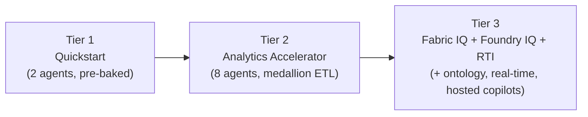

# Payer Healthcare Jumpstarts

Three packaged, validated entry points into the Fabric Payer Healthcare demo.
Each tier is a **strict superset** of the one below it, so you can start small
and promote without ever re-landing data or re-authoring agents.

| Tier | Jumpstart | Best for | Data | Agents | Highlights |
| --- | --- | --- | --- | --- | --- |
| **1** | [Quickstart](quickstart/) | Minutes-to-value demo, no ETL | **Pre-baked** gold parquet | 2 (`CFOAgent`, `StarsAgent`) | 1 lakehouse, 2-page report, 4 knowledge docs |
| **2** | [Analytics Accelerator](analytics/) | Full batch analytics with lineage | **Generated** by medallion chain | 8 DataAgents | 4-layer lakehouse, 7-page report, 2 pipelines, Mission Control router, 16-doc corpus |
| **3** | [Fabric IQ + Foundry IQ + RTI Accelerator](fabric-iq-rti/) | Real-time + graph + hosted copilots | **Generated** + KQL real-time | 8 DataAgents + 2 hosted copilots | Adds `Payer_Ontology` graph, Eventstream→Eventhouse→KQL→Reflex, 4 RTI notebooks, 17-doc corpus |

## Promotion path



Because each tier is a superset, the validator enforces that every lower-tier
**DataAgent**, **gold table**, and **knowledge doc** is present in the tier
above. Tier-specific launcher notebooks are the only intentional exception.

## Anatomy of a jumpstart

Each `<tier>/manifest.yaml` is the single source of truth and declares:

- `items` — the Fabric workspace artifacts to deploy (lakehouses, semantic
  model, DataAgents, report + pages, notebooks, pipelines, and for Tier 3 the
  ontology, real-time stack, and hosted copilots).
- `data` — either a pre-baked `gold_dir` of parquet (Tier 1) or
  `generated: true` (Tiers 2–3, produced by the medallion chain), plus the
  declared gold `tables`.
- `knowledge` — the payer-knowledge documents uploaded to `lh_gold_curated`.
- `use_cases` — the guided demo scenarios, each bound to a shipped surface.

## Validation

All three manifests are validated together by:

```bash
python tools/validate_jumpstart.py            # all tiers + tier-ordering
python tools/validate_jumpstart.py --manifest jumpstarts/quickstart/manifest.yaml
```

The validator checks: every declared item path exists (and deployable items
carry a `source`), report pages exist in `powerbi/pages.yaml`, data invariants
hold (pre-baked parquet matches exactly, or `generated` skips the parquet
check), the union of all agent `table_allowlist`s is a subset of the declared
gold tables, knowledge docs exist, and each use case targets a shipped surface.
This runs in CI on every push.
