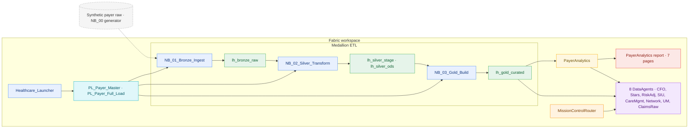

# Payer Analytics Accelerator — Tier 2 Jumpstart

The full **batch-analytics** demo for a health plan. You get the four-layer
medallion lakehouse, the `PayerAnalytics` semantic model, **all eight** Foundry
DataAgents behind the Mission Control router, the **seven-page** Power BI
report, the medallion notebook chain + orchestration pipelines, and the full
payer-knowledge corpus. Gold data is **generated by the ETL chain** so you see
the medallion lineage end to end.

> **Promotion path:** Quickstart (Tier 1) → **Analytics Accelerator (Tier 2)** →
> Fabric IQ + Foundry IQ + RTI Accelerator (Tier 3). Tier 2 is a strict
> superset of Tier 1 — every agent, table, and knowledge doc carries forward.

## Architecture

> The diagram source of truth is the `mermaid_diagram` block in
> [`manifest.yaml`](manifest.yaml); CI fails if a tier is missing it.

## What's in the box

| Component | Items |
| --- | --- |
| Medallion lakehouse | `lh_bronze_raw`, `lh_silver_ods`, `lh_silver_stage`, `lh_gold_curated` |
| Semantic model | `PayerAnalytics` |
| Foundry DataAgents (8) | `CFOAgent`, `StarsAgent`, `RiskAdjustmentAgent`, `SIUAgent`, `CareMgmtAgent`, `NetworkAgent`, `UMAgent`, `ClaimsRawExplorer` |
| Router | `MissionControlRouter` (`mission_control/`) |
| Report (7 pages) | `01_Executive` → `07_ClaimCaseSummary` |
| Notebooks | `NB_00`…`NB_03` + `Healthcare_Launcher` |
| Pipelines | `PL_Payer_Master`, `PL_Payer_Full_Load` |
| Knowledge | 16-document payer corpus |
| Gold | 35 tables, generated by the medallion chain |

The single source of truth is [`manifest.yaml`](manifest.yaml), validated in CI
by `tools/validate_jumpstart.py`.

## Install

1. Deploy the items into a Fabric workspace (`fabric-cicd` or the Jumpstart
   catalog installer).
2. Open **`Healthcare_Launcher`** and **Run All** — it generates the smoke
   dataset (optional), runs the medallion chain (`NB_01` → `NB_02` → `NB_03`),
   uploads the knowledge corpus, rebinds the 8 DataAgents, and sanity-checks
   the gold tier.

## Six guided use cases

| # | Ask | Surface |
| --- | --- | --- |
| **UC-A1** | "Where is MLR trending and which payer/LOB drives it?" | `CFOAgent` |
| **UC-A2** | "Which HEDIS measures sit below the Stars cut point this year?" | `StarsAgent` |
| **UC-A3** | "Where are our suspected HCC gaps and what RAF lift do they imply?" | `RiskAdjustmentAgent` |
| **UC-A4** | "Which providers show FWA-suspect billing patterns?" | `SIUAgent` |
| **UC-A5** | "Which prior-auth lines are breaching SLA and where is TAT worst?" | `UMAgent` |
| **UC-A6** | "Pull every adjudicated line for a claim with CARC explanations." | `ClaimsRawExplorer` |

Ask any of these in the Mission Control router (or the agent directly) — the
router classifies the question and dispatches to the right persona agent.

## Notes

- **Generated vs. pre-baked** — Tier 2 runs the medallion chain (full lineage).
  For a no-ETL minutes-to-value path, use [Tier 1 Quickstart](../quickstart/).
- **Real-time + ontology + hosted copilots** — add the streaming stack, the
  `Payer_Ontology` graph, and the two Foundry copilots with
  [Tier 3](../fabric-iq-rti/).
