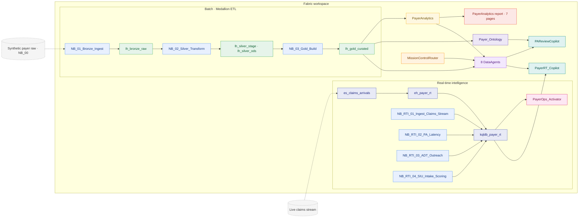

# Fabric IQ + Foundry IQ + RTI Accelerator — Tier 3 Jumpstart

The **complete payer platform**. Everything in the
[Analytics Accelerator (Tier 2)](../analytics/) **plus**:

- **Fabric IQ** — the `Payer_Ontology` semantic graph linking member →
  provider → claim → auth → appeal.
- **Real-Time Intelligence** — Eventstream → Eventhouse → KQL DB → Reflex
  Activator, driven by four RTI notebooks.
- **Foundry IQ** — two hosted copilots (`PAReviewCopilot`, `PayerRT_Copilot`)
  that orchestrate the eight DataAgents, the ontology graph, and the RTI
  surfaces.

> **Promotion path:** Quickstart (Tier 1) → Analytics Accelerator (Tier 2) →
> **Fabric IQ + Foundry IQ + RTI Accelerator (Tier 3)**. Tier 3 is a strict
> superset of Tier 2 — promotion is purely additive (no data re-landing).

## Architecture

> The diagram source of truth is the `mermaid_diagram` block in
> [`manifest.yaml`](manifest.yaml); CI fails if a tier is missing it.

## What's in the box (additive over Tier 2)

| Component | Items |
| --- | --- |
| Ontology (Fabric IQ) | `Payer_Ontology` |
| Real-time stack | `es_claims_arrivals` (Eventstream) → `eh_payer_rt` (Eventhouse) → `kqldb_payer_rt` (KQL DB) → `PayerOps_Activator` (Reflex) |
| RTI notebooks | `NB_RTI_01_Ingest_Claims_Stream`, `NB_RTI_02_PA_Latency`, `NB_RTI_03_ADT_Outreach`, `NB_RTI_04_SIU_Intake_Scoring` |
| Hosted copilots (Foundry IQ) | `PAReviewCopilot`, `PayerRT_Copilot` |
| Knowledge | 17-document corpus (adds `rti_ops_runbook.md`) |

Plus everything from Tier 2: 4 lakehouses, `PayerAnalytics` semantic model, all
8 DataAgents, the 7-page report, the medallion notebook chain + pipelines, the
Mission Control router, and the full gold tier (35 tables).

The single source of truth is [`manifest.yaml`](manifest.yaml), validated in CI
by `tools/validate_jumpstart.py`.

## Install

1. Deploy the items into a Fabric workspace (`fabric-cicd` or the Jumpstart
   catalog installer). The two hosted copilots deploy separately via
   `tools/deploy_foundry.py` (Foundry, not `fabric-cicd`).
2. Open **`Healthcare_Launcher`** and **Run All** for the batch tier (medallion
   chain, knowledge upload, DataAgent rebind).
3. Run the **RTI notebooks** (`NB_RTI_01` → `NB_RTI_04`) to wire the
   Eventstream, land real-time tables into `kqldb_payer_rt`, and arm the
   `PayerOps_Activator` rules.

## Nine guided use cases

| # | Ask | Surface |
| --- | --- | --- |
| **UC-F1** | "Where is MLR trending and which payer/LOB drives it?" | `CFOAgent` |
| **UC-F2** | "Which HEDIS measures sit below the Stars cut point this year?" | `StarsAgent` |
| **UC-F3** | "Where are our suspected HCC gaps and what RAF lift do they imply?" | `RiskAdjustmentAgent` |
| **UC-F4** | "Which providers show FWA-suspect billing patterns?" | `SIUAgent` |
| **UC-F5** | "Which prior-auth lines are breaching SLA and where is TAT worst?" | `UMAgent` |
| **UC-F6** | "Trace a claim across the ontology graph: member → provider → auth → appeal." | `ClaimsRawExplorer` |
| **UC-F7** | "Real-time: which claim streams are breaching PA latency right now?" | `PayerRT_Copilot` |
| **UC-F8** | "Assemble a prior-auth review packet with policy citations for a member." | `PAReviewCopilot` |
| **UC-F9** | "Where do OON leakage and directory inaccuracy concentrate?" | `NetworkAgent` |

## Notes

- **Hosted copilots** declare `authoring` only (no `fabric-cicd` `source`) —
  they deploy to Foundry, where they call the eight DataAgents as tools and
  ground answers in the ontology graph and the knowledge corpus.
- **Real-time tables** live in `kqldb_payer_rt` (landed by the RTI notebooks),
  not the gold lakehouse — `manifest.yaml`'s `data.tables` is the batch gold
  slice, and the `rti` block documents the streaming surfaces.
