# Payer Quickstart — Tier 1 Jumpstart

The smallest deployable slice of the **Fabric Payer Healthcare Demo**. In a few
minutes you get a curated gold lakehouse, the `PayerAnalytics` semantic model,
two Foundry DataAgents (**CFO** and **Stars/Quality**), and a 2-page Power BI
report — with **pre-baked gold data**, so there is no ETL run to wait on.

> **Promotion path:** Quickstart (Tier 1) → Analytics Accelerator (Tier 2) →
> Fabric IQ + Foundry IQ + RTI Accelerator (Tier 3). A Tier 1 install is a
> strict subset of the full workspace, so upgrading never re-lands this data.

## Architecture

<picture>
  <source media="(prefers-color-scheme: dark)" srcset="../../assets/images/diagrams/quickstart_dark.svg">
  
</picture>

> The diagram source of truth is the `mermaid_diagram` block in
> [`manifest.yaml`](manifest.yaml); CI fails if a tier is missing it or its
> rendered SVGs. Regenerate the icon-accurate SVGs by pasting that block into
> the [Fabric Jumpstart Diagram Generator](https://jumpstart.fabric.microsoft.com/tools/diagram-generator)
> with slug `quickstart`, then drop the downloaded
> `quickstart_light.svg` / `quickstart_dark.svg` into
> [`assets/images/diagrams/`](../../assets/images/diagrams/).

## What's in the box

| Component | Item | Source |
| --- | --- | --- |
| Gold lakehouse | `lh_gold_curated` | `workspace/lh_gold_curated.Lakehouse` |
| Semantic model | `PayerAnalytics` | `workspace/PayerAnalytics.SemanticModel` |
| CFO agent | `CFOAgent` | `workspace/CFOAgent.DataAgent` |
| Stars/Quality agent | `StarsAgent` | `workspace/StarsAgent.DataAgent` |
| Report (2 pages) | `PayerAnalytics` — `01_Executive`, `03_StarsQuality` | `powerbi/PayerAnalytics.Report` |
| Launcher | `quickstart_launcher` | `jumpstarts/quickstart/quickstart_launcher.Notebook` |
| Pre-baked gold | 14 Delta/parquet tables | `jumpstarts/quickstart/data/gold/` |

The 14 gold tables are the union of the `CFOAgent` and `StarsAgent` table
allowlists, so every agent answer and report visual has the surface it needs:

- **Facts** — `fact_claim`, `fact_appeal`, `fact_premium`, `fact_member_month`,
  `fact_quality_event`
- **Marts** — `agg_mlr_monthly`, `agg_denial_by_payer`, `agg_stars_compliance`
- **Dimensions** — `dim_member`, `dim_payer`, `dim_product`, `dim_lob`,
  `dim_provider`, `dim_date`

The single source of truth for this tier is
[`manifest.yaml`](manifest.yaml), validated in CI by
`tools/validate_jumpstart.py`.

## Install

1. Deploy the quickstart items into a Fabric workspace (via `fabric-cicd` or
   the Jumpstart catalog installer).
2. Open **`quickstart_launcher`** and **Run All**. It:
   1. Loads the pre-baked gold parquet from GitHub raw into `lh_gold_curated`
      as managed Delta tables (no medallion ETL).
   2. Uploads the four cited `payer_knowledge` docs.
   3. Rebinds `CFOAgent` + `StarsAgent` placeholder GUIDs to the real
      lakehouse + semantic-model ids.
   4. Runs a gold-tier + publish-state sanity check.

## Three guided use cases

### UC-Q1 — Medical loss ratio trend *(ask `CFOAgent`)*
> "Where is medical loss ratio trending and which payer is driving it?"

Pulls `MedicalLossRatio`, `TotalPaidAmount`, and `TotalPremiumRevenue` across
`dim_payer` and `dim_date`. Cross-check visually on report page **01_Executive**
(MLR card + "MLR by LOB" + "Payer mix" table).

### UC-Q2 — Denial drivers and appeal overturns *(ask `CFOAgent`)*
> "Which CARC codes drive our denials and how often are appeals overturned?"

Uses `DenialRate`, `DeniedClaimCount`, and `AppealOverturnRate` over
`fact_claim` / `fact_appeal`, grounded in `carc_reference.md`. The agent
explains each CARC code in plain English instead of leaving you to decode it.

### UC-Q3 — HEDIS measures below the Stars cut point *(ask `StarsAgent`)*
> "Which HEDIS measures are below the Stars cut point this measurement year?"

Uses `HEDISCompliancePct` and `StarsContractRating` over `fact_quality_event`
and `agg_stars_compliance`, grounded in `hedis_my2026_measures.md` +
`stars_2026_cutpoints.md`. Visualize on report page **03_StarsQuality**.

## Notes

- **Pre-baked vs. fresh data** — this launcher does *not* run the medallion
  chain. To regenerate from synthetic raw, use the full demo's
  `Healthcare_Launcher` (Tier 2+).
- **Knowledge corpus** — only the four documents these two agents cite are
  uploaded here; the full corpus ships with Tier 2+.
